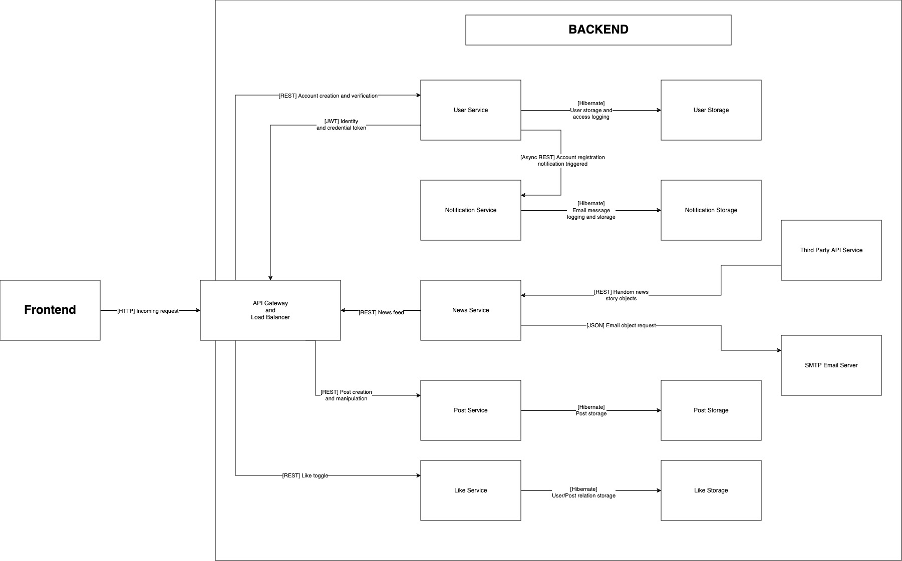

# Project Summary

This application is a messaging client that includes all the core functionalies of Twitter in a single, instantly deployable package. It is suitable for internal use as an intra-organizational messaging application or for hosting private, password protected chatrooms governed by an administrator. This application will include functionality such as:

* global message board (MVP)
* authentication (MVP)
* authorization (MVP)
* likes (MVP)
* dislikes (MVP)
* page pagination (MVP)
* hashtag/topic grouping (MVP)
* basic hashtag/topic search (MVP)
* accounts (MVP)
* news feed from randomized API (MVP)
* private chat rooms (stretch goal)
* images (stretch goal)
* email (stretch goal)
* multifactor login (stretch goal)
* OAuth (stretch goal)

---
# Stack

* Backend:
  * Java and Kotlin Spring Boot microservices
  * Python FastAPI microservices
  * MySQL database with phpMyAdmin for service databases
  * RestClient HTTP client for inter-service communication
  * Resiliance4j as curcuit breaker/fault tolerance mechanism
  * Loki for aggregation and log management
  * Prometheus for metrics collection and monitoring
  * Tempo for distributed tracing
  * Grafana for data visualization via dashboard

* Frontend:
  * NextJS with TypeScript
  * DaisyUI component library

* DevOps:
  * Docker for containerization
  * Kubernetes for container orchestration and service discovery

* Documentation:
  * Swagger

A tabulated representation of the project's tech stack may be found below:

| Service              | Framework | Language | Database | Core Libraries and External Services |
| :------------------- | :-------- | :------- | :------- | :----------------------------------- |
| User Service         | Spring    | Java     | MySQL    | JWT user authentication              |
| Post Service         | Spring    | Java     | MySQL    | None                                 |
| Like Service         | Spring    | Kotlin   | MySQL    | None                                 |
| Notification Service | Spring    | Java     | MySQL    | SMTP mail server                     |
| News Service         | FastAPI   | Python   | None     | News API external service            |

| Client                | Framework | Language   | Core Libraries and External Services |
| :-------------------- | :-------- | :--------- | :----------------------------------- |
| Web Client (frontend) | NextJS    | TypeScript | DaisyUI                              |

| DevOps Tool | Purpose                                    |
| :---------- | :----------------------------------------- |
| Docker      | Containerization/virtualization            |
| Kubernetes  | Container management and service discovery |

---
# Installation

**Before proceeding**, note that for email-service to work, you must enter your own credentials (email and app password) into the mail-service's application.properties. For instructions on how to configure an app password (note that this is **not** the same as your account's password), visit this [resource](https://support.google.com/mail/answer/185833?hl=en). Create a `secrets.properties` file in the `~./src/main/resources` directory, copy over the fields defined in the `secrets.properties.example` in that same directory, then place your email address and app password in the appropriate fields.

Installation is managed by a sinlge `bash` script. To deploy locally or remotely to a server (on premise or cloud), just run `start.sh`.

---
# Getting Started

An account is only required if users wish to post messages or join specific chat rooms. Unauthenticated users may browse and search global posts freely.

To create an account, register using your email, or login using your Google, Facebook, Instagram, or Twitter[1] account

---
# License

The MIT License (MIT)

Copyright (c) Samuel Schneider 2024

# Acceptance Criteria
* Global messaging board:
  - Posts are displayed in reverse chronological order.
  - Pagination utilized to reduce page load times

* Authentication:
  - Users must register with valid email, phone number, and username to ensure that users are real people.
  - Unique constraints places on these attributes to eliminate false representation.
  - Posts can only be written or modified by thr original user. User must be authenticated.

* Likes/Dislikes:
  - Users can like or unlike a post in real time.
  - Liked work as a toggle with a maximum of one like per user.
  - Users must be authenticated to like posts.
  - Users may like their own posts.

* Hashtag/Topic Grouping:
  - Users may attach hashtags to posts to group similar posts together.
  - Posts may be searchable, allowing users to perform custom queries and filters on the corpus of data.

* News Feed:
  - News provided from randomized API integrated into the user's feed.
  - News feed provides links to external sources for futher reading.

---
# User Stories

* As a user, I want to monitor my posts' popularity by checking the likes and dislikes it receives from others (MVP).
* As a regretful user, I want to be able to delete my posts so that I can avoid embarassment when I sober up (MVP).
* As an unregistered user, I want to freely browse and searchglobal posts and feeds so that I can experience this app without registering (MVP).
* As a new user, I want to authenticate my account so that others cannot post under my name (MVP).
* As a poster, I want to group my posts together so that they are tied with others of a similar interest (MVP).
* As a user, I want to get randomized news in my feed so that I can make informed decisions with my life and finances (MVP).

* As a chat room administrator, I want to delete chats from my chatroom to maintain the character of the chat community (stretch goal).
* As a user, I want to be able to upload images so that I can share pet pictures (stretch goal).
* As a chat room administrator, I want to only allow approved users into my chat so that privacy is maintained (stretch goal).
* As a user, I want to be able to set pagination controls to cater to my preferences (stretch goal).

---
# Misuser Stories
* As a malicious user, I want to create fake accounts to spam posts and detract from the average user's experience.

* As a malicious user, I want to bypass authentication mechanisms to compromise user accounts and access private chats.

* As a malicious user, I want to impersonate someone else using their public facing information (i.e. email and username) to act in their name and harm their reputation.

* As a malicious user, I want to inflate the number of likes on my posts to increase my account traffic.

---
# Mitigation Criteria
* Fake accounts: implement email authentication (stretch goal: CAPTCHA) to ensure accounts are associated with real users.

* Authentication Security: Require strong password validation, enforce account lock after repeated failed logins, and store passwords securely in database, minimizing leakage of user verification information.

* Identity protection: ensure that personally identifiable information (email, phone number, username, etc.) are unique in database and minimally exposed to users and other services.

* Users limited to one like each. A dedicated database stores this relation and does not permit duplicates.

---
# Architecture Diagrams
High level architecture diagram of application and it's constituent microservices shown below:

  

---
# Footnotes
[1] Note that these are stretch goals
